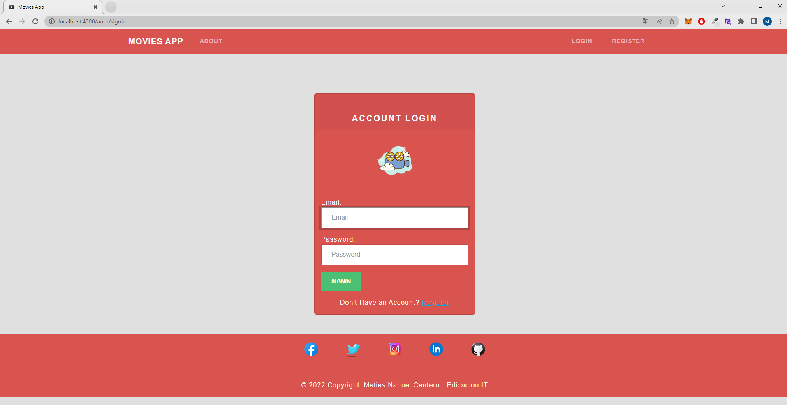

# Movies App NodeMongo

Movie centeres una simple app web en la cual podran navegar y ver distintas carteleras de peliculas. Esta app fue creada con tecnologias JS



### Installation

```sh
git clone https://github.com/MatiasCantero/proyectofinal
cd proyecto-final
npm i
npm run dev 
npm start 
```


### Environment Variables

Esta aplicacion necesita las siguientes variables de ambiente

- `MONGOATLAS` this is the Mongodb URI string
- `PORT` the server http port for the application
- `NODE_ENV` node environment

### docker-compose

para instalar con docker-compose

```shell
git clone https://github.com/MatiasCantero/proyectofinal
cd proyecto-final
docker-compose up
```

### Default User

Cuando la app sea desplegada, creara el siguiente usuario

- email: `test@localhost`
- password: `testpassword`


